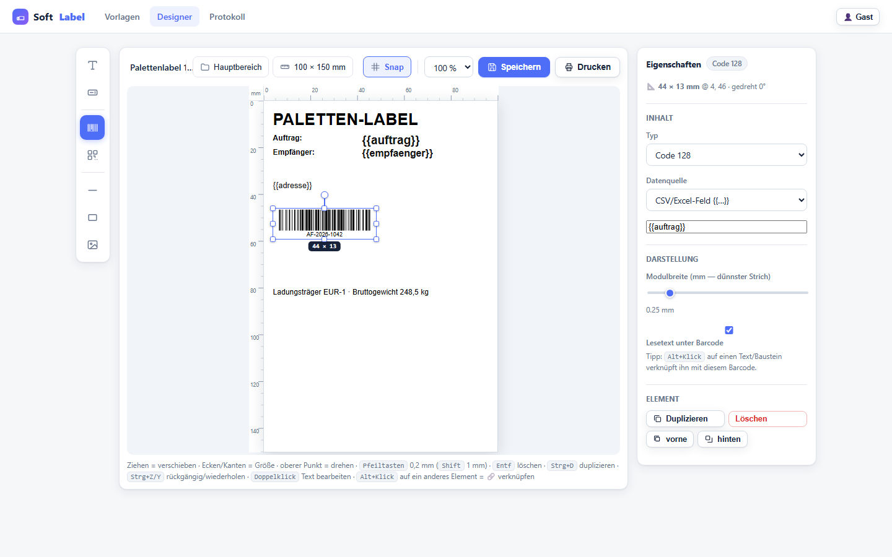

# SoftLabel — Label-Designer als Web-App für die Logistik

Zebra Designer / BarcodeForge-Alternative **ohne lokale Installation**: Im Browser
entwerfen, aus Excel/CSV befüllen, als **PDF, PNG, SVG oder Zebra-ZPL** exportieren.
Wird als Docker-Container in Portainer gehostet, alle Nutzer im Unternehmen
erreichen sie über `http://<server>:8000/`.



## Funktionen

| Bereich | Details |
|---|---|
| **Designer (mm-genau)** | Text, Datenfelder, Barcodes, Linien, Rahmen, Bilder/Logos; alles visuell: ziehen, 8 Anfasser für Größe, Drehpunkt, Snap-Führungslinien, mm-Lineale, Maß-HUD — keine Koordinaten-Felder nötig. Labelgröße einmal im Größen-Popover in mm eingeben |
| **Barcodes** | Code 128, EAN-13/8, UPC-A, Code 39, ITF-14, 2 inter 5, Pharmacode, QR-Code, DataMatrix*. Automatische Prüfziffer bei EAN/UPC/ITF; Modulbreite in mm (= Druckqualität). *DataMatrix braucht optionale libdmtx (`requirements`-Kommentar) |
| **Vorlagen-Vordefinitionen** | entfallen — Größe einfach in mm eingeben (Größen-Popover); Bogenlayout optional (Labels/Spalten/Rand/Abstand) |
| **Ordner & Archiv** | Kunden-/Projektordner anlegen, umbenennen, löschen (Labels bleiben im Hauptbereich erhalten); Labels per „Verschieben“ ein-/umhängen; **beim ersten Speichern einer neuen Vorlage fragt der Designer nach dem Zielordner** (Chip in der Toolbar, neuer Ordner direkt im Dialog anlegbar); Archiv-Seite mit **Wiederholen** und **Endgültig löschen** — Löschen ist nur aus dem Archiv möglich (Versehensschutz) |
| **Datenmerge** | Platzhalter `{{spaltenname}}` (auch `{{feld|upper}`) in Text & Barcode; CSV/TSV/Excel-Upload mit Spaltenerkennung, Zeilennavigation, Vorschau pro Datensatz; alternativ manuelle Eingabe |
| **Baustein-Verknüpfung** | Jeder Barcode, QR-Code und jedes Textelement kann per 🔗 an einen anderen Baustein (Datenfeld/Text) gebunden werden — mehrfache Barcodes zu einem Feldeintrag, Ketten (Feld→Text→QR) möglich, Zyklen geschützt. Im Designer als orangefarbene Verbindungslinie sichtbar; Live-Wert in Vorschau, PNG/PDF/SVG und ZPL |
| **Export** | PDF (mehrseitig, Bogenlayout für Schneidedrucker), PNG in Vorlagen-DPI (druckfertig), SVG-Einzelvektor, **ZPL** für Zebra (Kopieren/Senden, WebSerial in Chrome/Edge) |
| **Drucken** | Browser-Druckdialog mit exakter `@page`-Größe (Maßstab 100 %) |
| **Protokoll** | Export-Jobs + Änderungsaudit (Vorlagen, Assets, Archiv) |
| **Sonstiges** | Vorlagen archivieren/wiederherstellen, duplizieren; Bild-Asset-Bibliothek mit Upload |

## Schnellstart lokal (Windows, ohne Docker)

```bat
cd C:\hermes\Softlabel
pip install -r requirements.txt
python run.py            → http://localhost:8000
```

## Docker

```bash
docker build -t softlabel .
docker run -d --name softlabel -p 8000:8000 -v softlabel-data:/data softlabel
```

### Portainer (empfohlener Weg)

1. **Stacks → Add stack**: `docker-compose.yml` aus diesem Ordner einfügen
   (oder Repo-URL angeben). Volume `softlabel-data` wird automatisch angelegt —
   dort liegen Datenbank, Vorlagen und Bilder.
2. **Ports**: 8000 → 8000 (oder euren internen Standard-Port).
3. Container-Neustarts überleben alles; Backup = Volume sichern.

Variablen (über Stack `environment` oder `.env`):

| Variable | Default | Zweck |
|---|---|---|
| `SL_BASE_PATH` | leer | URL-Präfix hinter Reverse-Proxy, z. B. `/softlabel` |
| `SL_DATA_DIR` | `/data` | Datenverzeichnis |
| `PUID`/`PGID` (Build-arg) | 1000 | Volume-Rechte anpassen |
| `PIP_INDEX_URL` (Build-arg) | pypi.org | interner Python-Spiegel möglich |

## Multi-User-Betrieb

Die App ist für gleichzeitige Nutzung ausgelegt: SQLite im **WAL-Modus** (Leser blockieren Schreiber nicht), alle Renderings/Importe laufen im **Worker-Thread** statt im Event-Loop, 4 gleichzeitige 60-Seiten-PDF-Exporte blockieren leichte Requests nicht (p50 16 ms). **Optimistische Sperre**: Speichert ein zweiter Nutzer dieselbe Vorlage, antwortet der Server 409 mit Dialog „fremde Änderungen laden / überschreiben“. Der „👤“-Button oben rechts setzt den Namen fürs Protokoll (Cookie).

## Hinweise

- **Kein Login** (bewusst, wie requested): Die App ist fürs interne Netz gedacht;
  Zugangsschutz am besten über Reverse-Proxy/VPN oder Windows-Freigabe-Gruppe.
  Audit-Log zeigt Akteur, wenn `sluser`-Cookie gesetzt wird.
- **Drucktreue**: PDF/PNG werden bei Vorlagen-DPI gerendert (Standard 300).
  Beim Browser-Druck „tatsächliche Größe/100 %“ wählen, Ränder aus.
- **Zebra**: `ZPL`-Export-Datei per Copy-Paste ins ZebraDesigner-/WebPrint-Fenster
  oder „An Drucker senden“ (USB-Seriell-Port via WebSerial in Chrome/Edge).
- **DataMatrix**: Standard-Image enthält keinen Encoder (libdmtx). Optional in
  `requirements.txt` `python-datamatrix` einkommentieren oder pylibdmtx + `libdmtx0a`
  installieren; fehlt er, zeigt das Label eine klare Fehlermeldung statt abzustürzen.
- Beispieldaten: Drei fertige Vorlagen (Palette 100×150, Paket 105×148, Regal 2×70×25)
  sind beim ersten Start angelegt und werden bei Löschung automatisch wiederhergestellt.

## Tests

```bash
python scripts/smoke_test.py   # 58 API-/Export-Prüfungen (PDF-Seitenzahl, mm-Formate, 300dpi-PNG, ZPL, Import, Ordner/Archiv, rev-Konflikt …)
python scripts/ui_test.py      # Browser-Prüfungen (Drag, Resize, Speichern, CSV-Import, Downloads) via Playwright
python scripts/test_folders.py # Ordner-End-to-End: anlegen/umbenennen/verschieben/archivieren/wiederholen/löschen
python scripts/test_barwidth.py# Barcode-Breite ziehen = Modulbreite skaliert mit
```

## Projektstruktur

```
app/
  main.py         FastAPI-Endpunkte (Seiten + JSON-API)
  db.py           SQLite (Templates, Assets, Jobs, Audit) + Beispielvorlagen
  barcode.py      Strichmuster → exaktes mm-SVG / PNG bei Druck-DPI
  vector.py       SVG-Rasterisierung (PyMuPDF)
  render.py       PDF (ReportLab) + HTML-Vorschau
  pngrender.py    PNG-Renderer (Pillow)
  zpl.py          Zebra ZPL II Export
  datio.py        CSV/TSV/XLSX-Import
  elements.py     {{feld}}-Platzhalter, Felderkennung
  fonts.py        System-TTF-Discovery (Helvetica/Times/Courier → Arial/Liberation/DejaVu)
  templates/      home, designer, drucken, protokoll
  static/         app.css, designer.js, print.js
run.py            Start (lokal + Container)
Dockerfile, docker-compose.yml, requirements.txt, .env.example
scripts/          smoke_test.py, ui_test.py, kill_dev.ps1
docs/screenshots/
```
